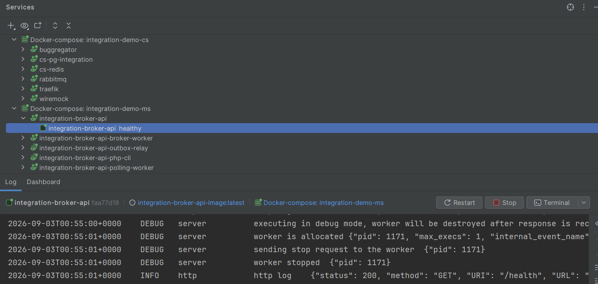

# Integration Demo-Service

1. [Описание предметной области](#1-описание-предметной-области)
2. [Стек](#стек)
3. [Архитектура и паттерны](#архитектура-и-паттерны)
4. [Пошаговое движение данных: Жизненный цикл заявки на биржу](#пошаговое-движение-данных-жизненный-цикл-заявки-на-биржу)
   - [Пример роута](#пример-роута)
   - [Этап 1: Синхронная обработка HTTP-запроса (Route -> DB)](#этап-1-синхронная-обработка-http-запроса-route---db)
   - [Этап 2: Передача данных в брокер сообщений (Outbox Worker -> RabbitMQ)](#этап-2-передача-данных-в-брокер-сообщений-outbox-worker---rabbitmq)
   - [Этап 3: Асинхронная отправка брокеру (RabbitMQ -> Consumer Worker -> API Партнера)](#этап-3-асинхронная-отправка-брокеру-rabbitmq---consumer-worker---api-партнера)
   - [Этап 4: Обработка ответа внешнего API (Изменения в БД)](#этап-4-обработка-ответа-внешнего-api-изменения-в-бд)
   - [Этап 5: Синхронизация статуса исполнения (Background Polling)](#этап-5-синхронизация-статуса-исполнения-background-polling)
5. [Установка и запуск](#установка-и-запуск)

---

## 1. Описание предметной области

Наш продукт — это финтех-приложение (специализированное приложение для инвестиций), которое предоставляет клиентам (физическим лицам) возможность покупать и продавать ценные бумаги (акции, облигации, ETF). 

Поскольку у нас нет собственной брокерской лицензии, мы выступаем в роли «Представляющего брокера» (Introducing Broker) и интегрируемся по API с крупным лицензированным Брокером (партнером). 

**Зона ответственности нашего сервиса:**
*   Клиенты взаимодействуют исключительно с нашим приложением (UI/UX).
*   Наш бэкенд транслирует действия клиентов (выставление заявок, запрос портфеля, просмотр истории) в вызовы к внешнему API Брокера.
*   Деньги и активы физически хранятся на счетах у партнера-Брокера.

---

## Стек

### PHP и RoadRunner

| Компонент | Версия |
|---|---|
| PHP | **8.5** (`php:8.5-cli`) |
| RoadRunner (бинарник) | **2025.1.0** |
| spiral/roadrunner (PHP) | **v2025.1.15** |
| baldinof/roadrunner-bundle | **3.4.0** |
| Symfony | **8.0.*** (lock: **v8.0.15**) |
| Doctrine ORM | **3.6.8** |
| lexik/jwt-authentication-bundle | **v3.2.0** |
| phpredis | **6.3.0** |
| php-amqp | **2.2.0** |

Минимальная версия PHP в `composer.json`: `>=8.4`. Расширения: `pdo_pgsql`, `redis`, `amqp`, `sockets`.

HTTP-контейнер `integration-broker-api` стартует командой `rr serve -c .rr.dev.yaml`: RoadRunner слушает `:8080`, проксирует запросы в пул из 2 worker'ов, каждый выполняет `php public/index.php`. Traefik маршрутизирует `api.integration-demo.local` на этот порт.

Фоновые задачи (outbox relay, отправка брокеру, polling) работают **не** через RoadRunner, а в отдельных CLI-контейнерах на образе `php-cli` — `messenger:consume` и Scheduler.

### Инфраструктура (`common-services`)

Общие сервисы поднимаются отдельными compose-файлами в Docker-сеть `integration_demo_net`.  
Управление: `make cs-all-up` / `make cs-all-down` (см. [`common-services/common-services.mk`](common-services/common-services.mk)).

| Сервис | Версия (образ) | Контейнер | Порт на хосте | Роль |
|---|---|---|---|---|
| **Traefik** | `traefik:v3.6` | `traefik` | `80`, `8080` (dashboard) | Reverse proxy: маршрутизация по `Host()` на контейнеры приложения (`api.integration-demo.local`, `buggregator.integration-demo.local`) |
| **PostgreSQL** | `postgres:17-alpine` | `cs-pg-integration` | `5432` | Основная БД `integration_broker_db`: ордера, outbox, идемпотентность. Схема: [`common-services/postgresql/Init/01_init.sql`](common-services/postgresql/Init/01_init.sql) |
| **Redis** | `redis:7-alpine` | `cs-redis` | `6379` | Кэш OAuth-токена брокера, distributed lock при polling, stateful cache Symfony Scheduler |
| **RabbitMQ** | `rabbitmq:3-management` | `cs-rabbitmq` | `5672`, `15672` (UI) | Асинхронная обработка: outbox relay → отправка брокеру, retry с задержкой, DLQ |
| **WireMock** | `wiremock/wiremock:3.13.2` | `cs-wiremock` | `8081` | Эмуляция внешнего API брокера (OAuth, `POST/GET /v1/orders`) для локальной разработки |
| **Buggregator** | `ghcr.io/buggregator/server:latest` | `buggregator` | `8000`, `9912`, `9913` | Сбор логов, `var_dump` и отладочных событий из контейнеров приложения |

Все сервисы доступны друг другу по DNS-имени внутри `integration_demo_net` (например, `cs-pg-integration:5432`, `wiremock:8080`).

> Buggregator использует тег `latest` — единственный сервис без жёстко зафиксированной версии образа.

---

## Архитектура и паттерны

### Clean Architecture + CQRS (Action → Command/Query → Handler)

Приложение разделено на слои **Domain → Application → Infrastructure**. HTTP-слой не содержит бизнес-логики.

| Операция | Цепочка |
|---|---|
| **Write** | `Action` → `Command` → `Handler` → `Repository` |
| **Read** | `Action` → `Query` → `Handler` → чтение из БД |

Пример: `CreateOrderAction` собирает `CreateOrderCommand` и передаёт в `CreateOrderHandler`. Domain-сущность `Order` отделена от Doctrine `OrderOrm` через Mapper.

### Идемпотентность

Клиент передаёт `Idempotency-Key` (UUID). Повторный запрос с тем же ключом возвращает сохранённый ответ, без второй заявки брокеру.

### Transactional Outbox

В одной транзакции с записью ордера сообщение кладётся в `messenger_messages` (Doctrine-транспорт). Outbox Relay переносит его в RabbitMQ — так HTTP не зависит от доступности брокера очередей.

### Background Polling

После `SENT_TO_BROKER` исполнение на бирже асинхронно. Статусы подтягиваются фоном, а клиентский `GET` читает только нашу БД:

| Поток | Кто | Что делает |
|---|---|---|
| **A — обновление** | Symfony Scheduler → `PollOrderStatusesMessage` → `PollOrderStatusesHandler` | Выборка pollable-ордеров → `GET` у брокера → обновление `orders` |
| **B — чтение** | `GET /api/v1/investments/orders/{id}` | Только `SELECT` из PostgreSQL, без вызова брокера |

Lock по `order_id` на каждый poll; transient-ошибки брокера (в т.ч. 404) не валят тик — только `markPolled` + лог.

### Защита от Race Condition

- **OAuth-токен брокера:** Symfony Lock + double-checked locking при выдаче токена; compare-and-delete при `invalidate` после 401.
- **Обработка ордера / polling:** distributed lock по `order_id` (Redis), чтобы два воркера не обрабатывали одну заявку параллельно.

### Авторизация

| Контур | Механизм |
|---|---|
| **Клиент → наш API** | JWT (Lexik JWT Authentication Bundle), claim `client_id` |
| **Наш сервис → API брокера** | OAuth 2.0 **Client Credentials** (Server-to-Server): `client_id` / `client_secret` → `access_token`, кэш в Redis |

### Компоненты Symfony

| Компонент | Роль в проекте |
|---|---|
| **Messenger** | Outbox (`doctrine`), очередь `broker` (AMQP), retry / delay / DLQ при transient-ошибках |
| **Scheduler** | Периодический тик polling статусов ордеров (`order_polling` → `PollOrderStatusesMessage`) |
| **Lock** | Распределённые блокировки (OAuth, consumer, polling) |
| **HttpClient** | Вызовы внешнего API брокера (`HttpBrokerGateway`) |
| **Lexik JWT** | Аутентификация входящих запросов к `/api/v1/...` |
| **Doctrine ORM** | Персистентность ордеров и outbox |
| **Monolog** | Структурированные логи (`order_flow`) → Buggregator |

### Anti-Corruption Layer (брокер)

`BrokerGatewayInterface` + `HttpBrokerGateway` + `BrokerOrderRequestMapper`: внешний контракт брокера (строковые деньги, `instrument_ticker`, `side`) не протекает в Domain.

---

## Пошаговое движение данных: Жизненный цикл заявки на биржу

Разберём путь данных на примере создания заявки: от HTTP-запроса клиента до асинхронной отправки брокеру, обработки ответа и фонового опроса статуса исполнения. В основе — паттерн **Transactional Outbox** и **RabbitMQ**.

### Пример роута

**Запрос к нашему сервису:**  
`POST /api/v1/investments/orders`

**Headers:**
- `Authorization: Bearer <jwt>`
- `Idempotency-Key: <uuid-v4>` — генерирует фронтенд (защита от двойной покупки при ретрае сети)
- `Content-Type: application/json`

**Body:**
```json
{
  "ticker": "AAPL",
  "direction": "BUY",
  "quantity": 10,
  "type": "MARKET"
}
```

| Поле | Тип | Описание |
|---|---|---|
| `ticker` | string | Тикер инструмента |
| `direction` | string | `BUY` или `SELL` |
| `quantity` | int | Количество |
| `type` | string | Тип заявки (`MARKET`) |

**Ответ:** `202 Accepted`
```json
{
  "id": "ord_…",
  "status": "PROCESSING",
  "message": "Заявка отправлена на биржу"
}
```

Дальше заявка обрабатывается асинхронно по этапам ниже.

---

### Этап 1: Синхронная обработка HTTP-запроса (Route -> DB)

Все начинается с нажатия пользователем кнопки «Купить/Продать» в приложении.

1. **Запрос от клиента (Фронтенд -> API):**
  - Клиент отправляет `POST /api/v1/investments/orders`.
  - В теле передаются параметры сделки (`ticker`, `direction`, `quantity`, `type`).
  - В заголовках передается уникальный UUID `Idempotency-Key`, сгенерированный фронтендом.
2. **Открытие транзакции:**
  - хендлер сервиса открывает транзакцию в PostgreSQL.
3. **Проверка идемпотентности (БД):**
  - Выполняется запрос к БД (таблица `orders` или отдельная таблица ключей) на наличие `Idempotency-Key`.
  - *Если ключ найден:* Транзакция прерывается, сервис немедленно возвращает клиенту закэшированный результат предыдущего успешного запроса (защита от двойного списания при ретраях сети клиентом).
4. **Запись сущности (таблица `orders`):**
  - Если запрос уникален, создается новая запись в таблице `orders`.
  - **Состояние данных:** Ордер сохраняется со статусом `NEW`. Суммы и количество сохраняются во внутреннем формате (например, integer, центы).
5. **Запись события в Outbox (таблица `messenger_messages`):**
  - **Строго в рамках текущей транзакции** в таблицу `messenger_messages` (Doctrine-транспорт Symfony Messenger, очередь outbox) добавляется сериализованное сообщение `SendOrderToBrokerMessage`.
  - Это сообщение содержит `order_id` созданной заявки.
6. **Фиксация (Commit):**
  - Транзакция фиксируется. Обе записи (сам ордер и сообщение для отправки) синхронно и атомарно сохранены в БД.
7. **Ответ клиенту:**
  - Роут завершает работу и отвечает клиенту HTTP-статусом `202 Accepted` (Заявка принята в обработку).
  - Дальнейшая работа происходит асинхронно в фоне.

---

### Этап 2: Передача данных в брокер сообщений (Outbox Worker -> RabbitMQ)

Задача этого этапа — надежно переместить задачу из базы данных в очередь.

1. **Фоновое чтение (Relay / Publisher Worker):**
  - Отдельный фоновый процесс (Outbox Relay) непрерывно опрашивает таблицу `messenger_messages` на наличие новых, необработанных записей.
2. **Публикация в RabbitMQ:**
  - Воркер берет сообщение `SendOrderToBrokerMessage` из БД и публикует его в exchange/queue брокера RabbitMQ.
3. **Отметка о доставке (Изменение в БД):**
  - Дождавшись подтверждения (ACK) от RabbitMQ о том, что сообщение надежно сохранено на диске брокера очередей, воркер удаляет обработанную строку из таблицы `messenger_messages`.

---

### Этап 3: Асинхронная отправка брокеру (RabbitMQ -> Consumer Worker -> API Партнера)

Здесь выполняется тяжелая бизнес-логика интеграции с внешним миром.

1. **Чтение из очереди (Consumer Worker):**
  - Воркер-потребитель вычитывает сообщение `SendOrderToBrokerMessage` из очереди RabbitMQ.
2. **Эксклюзивная блокировка (Опционально):**
  - Чтобы предотвратить Race Condition (состояние гонки, когда RabbitMQ по какой-то причине доставил сообщение дважды разным воркерам), воркер может взять распределенную блокировку через Symfony Lock (Redis/PostgreSQL) на `order_id`.
3. **Обогащение данных (чтение из `orders`):**
  - Воркер делает `SELECT` из таблицы `orders` по `order_id`, чтобы получить актуальные данные о заявке.
4. **Авторизация (OAuth 2.0 / Redis):**
  - Воркер проверяет наличие валидного `access_token` в Redis.
  - Если токена нет, воркер делает запрос к Auth Server партнера, получает токен и кэширует его в Redis.
5. **Маппинг данных (Внутренний -> Внешний формат):**
  - Данные конвертируются под контракт брокера. Например, внутренние центы (integer) превращаются в строки с плавающей точкой (`"145.20"`).
6. **Внешний HTTP-запрос:**
  - Воркер делает вызов `POST https://api.partner-broker.com/v1/orders`.
  - **Важно:** Оригинальный `Idempotency-Key`, пришедший от мобилки, прокидывается в этот запрос.

---

### Этап 4: Обработка ответа внешнего API (Изменения в БД)

В зависимости от ответа API брокера, воркер меняет состояние данных в БД и принимает решение о дальнейшей судьбе сообщения.

#### Сценарий А: Успех (202 Accepted)

1. **Обновление таблицы `orders`:**
  - Статус ордера меняется с `NEW` на `SENT_TO_BROKER` (или `PENDING_ROUTING`).
  - В запись дописывается внешний идентификатор заявки брокера (внешний `order_id`), полученный в ответе.
2. **Завершение:** Воркер подтверждает обработку сообщения (RabbitMQ ACK), оно удаляется из очереди.

#### Сценарий Б: Временная ошибка (429, 502, 503, Timeout)

1. **Обновление таблицы `orders`:** Статус не меняется или переводится в `RETRYING`.
2. **Retry-стратегия:**
  - Воркер выбрасывает исключение (или делает NACK/Reject).
  - Сообщение возвращается в RabbitMQ.
  - Отрабатывает механизм **Exponential Backoff**: следующее чтение этого сообщения произойдет с задержкой (например, через 5 сек, затем 20 сек, 1 мин и т.д.).

#### Сценарий В: Фатальная ошибка (400, 401*, 403)

*(*При 401 предварительно делается однократный сброс кэша токена и retry, но если не помогло — это fatal)*

1. **Обновление таблицы `orders`:**
  - Статус ордера переводится в терминальное состояние `FAILED` или `REJECTED`.
2. **Dead Letter Queue (DLQ):**
  - Воркер делает ACK (сообщение уходит из основной очереди), но перенаправляет его в DLQ-очередь RabbitMQ для последующего логирования, алертинга и ручного разбора инженерами поддержки.

---

### Этап 5: Синхронизация статуса исполнения (Background Polling)

После успешной отправки заявка исполняется на бирже асинхронно. Чтобы не перегружать внешнее API и отвечать клиенту быстро, используется фоновый поллинг. Данные обновляются в два независимых потока:

**Поток А: Фоновое обновление (Backend -> Broker API)**
1. **Поиск активных заявок:** Специальный фоновый процесс (Polling Worker) с заданной периодичностью (например, раз в 5-10 секунд) делает выборку из таблицы `orders` всех заявок, находящихся в нетерминальных статусах (например, `SENT_TO_BROKER`, `PARTIALLY_FILLED`).
2. **Опрос Брокера:** Для каждой найденной заявки воркер выполняет HTTP-запрос `GET https://api.partner-broker.com/v1/orders/{id}` во внешнее API.
3. **Обновление БД:** Если в ответе брокера статус изменился (например, заявка исполнилась: `FILLED`), воркер конвертирует суммы в центы и обновляет статус, исполненный объем и другие данные в нашей таблице `orders`.

**Поток Б: Чтение данных клиентом (Frontend -> Backend)**
1. **Запрос статуса:** Фронтенд периодически вызывает роут `GET /api/v1/investments/orders/{id}`.
2. **Чтение из БД:** Контроллер нашего сервиса **не делает** запросов к брокеру. Он выполняет быстрый `SELECT` из таблицы `orders` по `id`.
3. **Мгновенный ответ:** Сервис сразу же отдает клиенту последний сохраненный статус заявки (актуальный на момент последнего прохода воркера).

---

## Установка и запуск

### Требования

- Docker и Docker Compose
- Make
- запись в `/etc/hosts` (Linux / macOS / WSL):

```
127.0.0.1 api.integration-demo.local
127.0.0.1 buggregator.integration-demo.local
```

### Первый запуск

Из корня репозитория:

```bash
make app-setup   # сеть, сборка образов, composer install, init PostgreSQL, JWT-ключи
make app-up      # common-services + integration-broker-api (+ воркеры)
```

| Команда | Что делает |
|---|---|
| `make app-setup` | Создаёт Docker-сеть `integration_demo_net`, собирает образы, `composer install`, инициализирует PostgreSQL, генерирует JWT-ключи |
| `make app-up` | Поднимает Traefik, PostgreSQL, Redis, RabbitMQ, WireMock, Buggregator и контейнеры API |
| `make app-down` | Останавливает сервисы |
| `make app-clear` | Останавливает сервисы и удаляет Docker-сеть |
| `make gen-jwt` | Генерирует RSA-ключи для JWT (если ещё нет) |
| `make gen-jwt-token` | Выпускает JWT и пишет его в `http-client.private.env.json` |

Так выглядит запущенный сервис (PhpStorm Services: common-services + API и воркеры):



### Проверка

```bash
curl -s http://api.integration-demo.local/health
```

Базовый URL API: `http://api.integration-demo.local`  
WireMock Admin: `http://localhost:8081/__admin`  
RabbitMQ UI: `http://localhost:15672` (`my_rabbit` / `rabbit`)  
Buggregator: `http://buggregator.integration-demo.local` или `http://localhost:8000`

Для ручных HTTP-запросов: `main-services/integration-broker-api/app/request.http` (environment `dev` в PhpStorm). Перед первым запросом:

```bash
make gen-jwt-token
```

